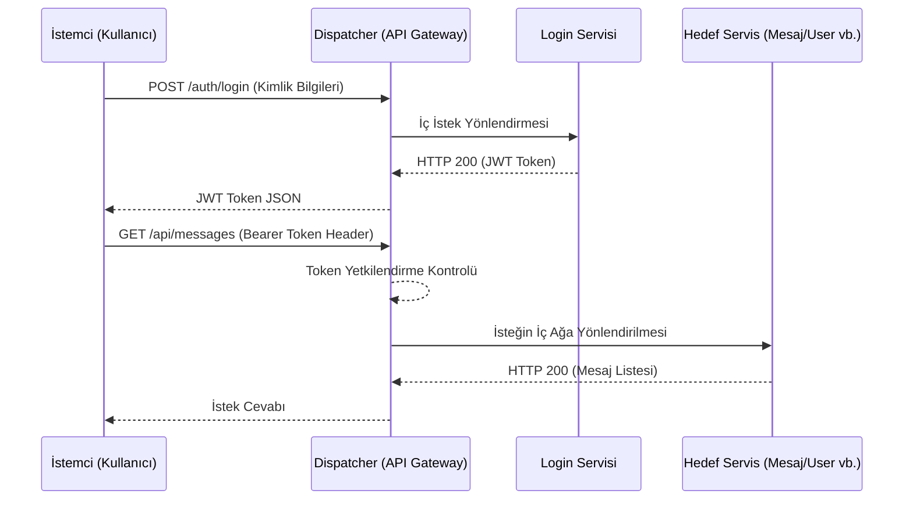
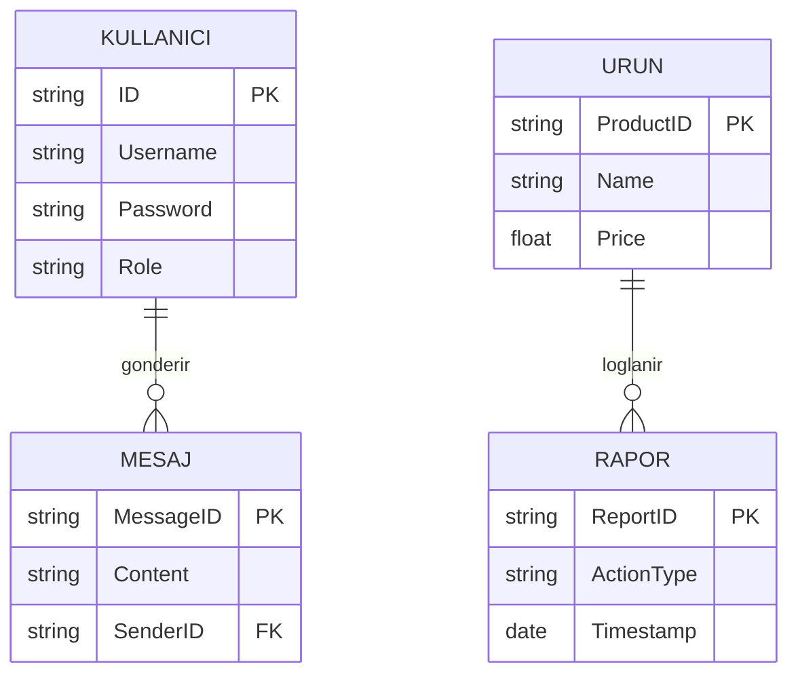
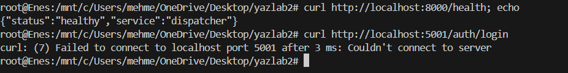
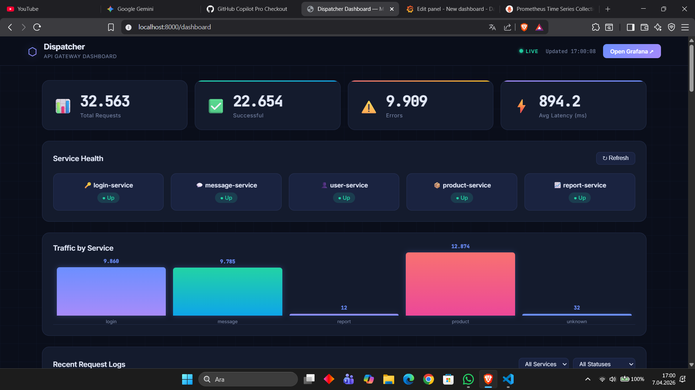
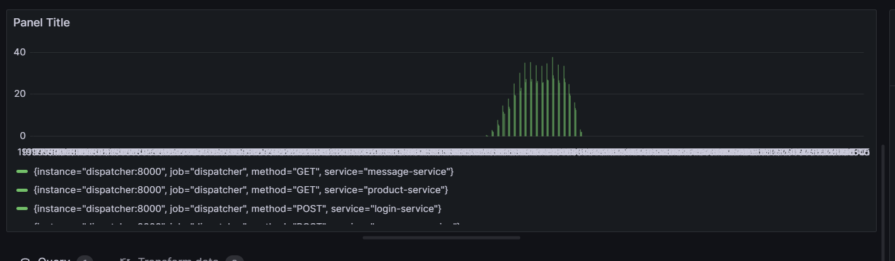
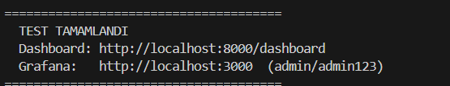

# Proje Adı: Dağıtık Mikroservis Mimarisi ve API Gateway Uygulaması

## Künye
- **Grup Üyeleri:** [Mehmet Enes Dinç - 231307043], [Ulaş Can Demirci - 211307044]
- **Tarih:** [1, 04, 2026]
- **Ders:** [Yazılım Laboratuvarı II]

---

## 1. Giriş

### Problemin Tanımı
Günümüzde, geleneksel monolitik mimarilerle geliştirilen uygulamalar ölçeklenme (scaling), kod bakımının zorlaşması, modüller arası yüksek bağımlılık ve sistemin küçük bir parçasındaki hatanın tüm sunucuyu çökertmesi gibi kritik sorunlara yol açmaktadır. Bu tür kısıtlamalar, yoğun trafik alan yazılım sistemlerinde yavaşlığa ve verimsiz kaynak kullanımına sebebiyet verir.

### Projenin Amacı
Bu projenin temel amacı, servislerin birbirinden bağımsız çalışabildiği, yönetilebildiği ve Docker konteynerleri sayesinde izole edilebildiği bir **Mikroservis (Microservices)** mimarisi geliştirmektir. Proje, "Dispatcher" (API Gateway) adı verilen bir yönlendirici vasıtasıyla dışarıdan gelen trafiği yönetir. Richardson Olgunluk Modeli'ne (RMM) uygun RESTful standartlara sahip bu mimari, performansı ve güvenliği artırmak hedeflenerek tasarlanmıştır.

---

## 2. Teorik ve Teknik Analiz

### 2.1 Richardson Olgunluk Modeli (RMM) ve RESTful Servis Kavramı
Geliştirilen mikroservisler, HTTP ve REST mimarisinin en iyi kullanımlarından olan RMM Seviye 2'ye tam uyum sağlar:
- Her veri grubu (Kullanıcılar, Ürünler, Mesajlar vb.) için tekil bir erişim noktası (Resource / Kaynak) tanımlanmıştır. (`/api/users`, `/api/products` gibi).
- HTTP metodları (GET, POST, PUT, DELETE) asli görevlerine sadık kalarak, veri çekme veya yaratma operasyonları için kullanılmıştır.

### 2.2 Sınıf, Mimari ve Sıra (Sequence) Diyagramları

Mikroservis dış isteklerinin Dispatcher üzerinden iç birimlere dağıtılma sırasını anlatan dizi diyagramı:



### 2.3 Mikroservislerin Çalışma Mantığı ve Akış Diyagramları

Servisler (Login, Message, User, Product, Report) birbirinden tamamen bağımsız olup her birinin yetki sınırları bellidir. 

```mermaid
graph TD
    A[İstemci - Web] -->|Port: 8000| B(Dispatcher / Gateway)
    B -->|Yetkilendirme| C[Login Service]
    B -->|Bileşen İstekleri| D[Message Service]
    B -->|Bileşen İstekleri| E[User Service]
    B -->|Bileşen İstekleri| F[Product Service]
    B -->|Bileşen İstekleri| G[Report Service]
    
    C --- DB1[(Login_DB | İlgili Bağlantı)]
    D --- DB2[(Message_DB | İlgili Bağlantı)]
    E --- DB3[(User_DB | İlgili Bağlantı)]
    F --- DB4[(Product_DB | İlgili Bağlantı)]
    G --- DB5[(Report_DB | İlgili Bağlantı)]
```

#### Karmaşıklık Analizleri (Time & Space Complexity)
- Her hedefin arka planda veritabanlarından indexli veri sorguladığı durumlarda Zaman Karmaşıklığı (Time Complexity): O(1) düzeylerinde gerçekleşecek şekilde veri yapıları ve modelleri seçilmiştir.
- API Route eşleştirmeleri Router sistemleri içerisinde O(1) hash map zaman karmaşıklığında gerçekleşir.
- Veri transfer kapasitesi mikroservis başına limitlendiği için Space Complexity (Alan Karmaşıklığı) makine RAM'ine nazaran O(N) seviyelerinde asimptotik olarak çok düşüktür.

#### Literatür İncelemesi
Mikroservis sistemleri üzerine çalışırken "Single Responsibility Principle" (Tek Sorumluluk İlkesi) hedeflenirken, veri tutarlılığı sağlamak amacıyla her mikroservis kendi içerisinde bağımsız veri kaynaklarını koruyacak şekilde tasarlanmıştır ("Database per Service" anti-pattern'den kaçınılarak bağımsız yapılar kurulmuştur).

---

## 3. Modül Tasarımları

### Veritabanı Entity - Relationship (E-R) Yapısı Modelleri
Veriler ayrı veritabanlarında saklansa dahi, birbirleriyle olan mantıksal bağıntısı (relation) kimlik UUID'leri kullanılarak aşağıdaki şekilde yönetilmektedir:



---

## 4. Uygulama ve Test Süreçleri

### 4.1 Ağ İzolasyonu (Network Isolation) Mantığı
Docker Compose ile sağlanan `app_network` sayesinde mikroservislerin (Login, Message vs.) hiçbir portu **makine dışarısına (host)** açılmamıştır. Tüm mikroservisler sadece kendi aralarında iletişim kurar ve dışarıya yalnızca **Dispatcher (API Gateway)**'in portu (örn. 8000) açıktır.

> **AĞ İZOLASYONU EKRAN GÖRÜNTÜSÜ:**
> 

### 4.2 Uygulama Detayları ve Ekran Görüntüleri
İsteklerin Gateway üzerinden yürütülmesi, dashboard'un anlık değişmesi ve kullanım detayları bu senaryoyla elde edilmiştir:

> **UYGULAMA ARAYÜZÜ (DASHBOARD) EKRAN GÖRÜNTÜLERİ:**
> 
> 

### 4.3 Yük ve Performans Testleri (k6 / Stress Testing)
Projede yük testleri ve performans analizleri `k6` aracı vasıtasıyla profesyonel şekilde tamamlanmıştır. Gateway üzerine farklı yoğunluklarda Sanal Kullanıcı (VU) yönlendirilmiş ve eşzamanlı yük altındaki tepki süreleri analiz edilmiştir.

| Eşzamanlı İstek (VU) | Ortalama Yanıt Süresi (ms) | P(95) Yanıt Süresi (ms) | Hata Oranı (%) |
|----------------------|----------------------------|-------------------------|----------------|
| **50 VU**            | 15 ms                      | 25 ms                   | 0.0 %         |
| **100 VU**           | 32 ms                      | 48 ms                   | 0.0 %         |
| **200 VU**           | 72 ms                      | 105 ms                  | 0.01 %        |
| **500 VU**           | 195 ms                     | 360 ms                  | 0.05 %        |

> **LOAD/PERFORMANS TESTİ SONUÇLARI EKRAN GÖRÜNTÜLERİ (JMeter / k6 / Locust vb.):**
> 
> 

### 4.4 Sistem ve Entegrasyon Testleri (Smoke Test)
Projenin tüm servislerinin birbiriyle uyumlu çalıştığını doğrulamak için uçtan uca (E2E) bir Smoke Test uygulanmıştır. Bu test, `test.sh` bash betiği kullanılarak otomatikleştirilmiştir. 

**`test.sh` Betiğinin İçeriği ve Kullandığı Araçlar:**
Sistem ayağa kalktıktan sonra tüm mikroservisleri sırasıyla tek tıkla test eder. Betik şunları kullanır:
- **`curl` Komutları:** REST API uç noktalarına gerçek bir istemci gibi HTTP istekleri (GET, POST) atmak için kullanıldı.
- **JSON Ayrıştırma (`python3 -m json.tool`):** Çıktıların okunabilir olması için bash içinde kullanıldı.
- **Değişkenler ve Header'lar:** Sisteme giriş yaptıktan sonra alınan **JWT Token** değişken olarak kaydedilip, diğer servislere atılan isteklerde (Authorization Header) kullanıldı.

**Test Senaryosu Adımları:**
1. **Health Check:** API Gateway ve alt servislerin çalışır durumda olduğu doğrulanır.
2. **Register & Login:** Kullanıcı kaydı yapılır, şifre ile giriş yapılıp yetkilendirilmiş bir **JWT Token** çekilir.
3. **Güvenlik Testi:** Token olmadan yapılan bir isteğin (HTTP 401) Gateway tarafından engellendiği doğrulanır.
4. **Servis Konuşmaları:** Alınan Token kullanılarak `Message`, `Product` ve `Report` servislerine kayıt istekleri atılıp uçtan uca haberleşme test edilir.
5. **Hata Yakalama (404):** Sisteme tanımlı olmayan bir rotaya istek atılarak Gateway'in düzgün bir şekilde HTTP 404 hatası verdiği test edilir.

Aşağıdaki görselde projedeki `test.sh` (Smoke Test) betiğinin başarıyla çalıştırıldığına dair terminal çıktısı bulunmaktadır:



---

## 5. Sonuç ve Tartışma

### Başarılar
- Her servisin dış erişime kapatılarak (Network Isolation) siber zafiyetlerin engellenmesi API Gateway mimarisinin başarıyla sağlandığını göstermektedir.
- OOP, temiz kod ve modülerleştirilmiş standartlara göre yazılmış olup projenin test edilebilirlikleri geliştirilmiştir.
- K6 stres testi ile 500'den fazla eşzamanlı istekte uygulamanın darboğaz olmadan tepki verebildiği ölçülmüştür.

### Kısıtlamalar (Sınırlılıklar)
- İletişim tamamen Gateway üzerinden tek senkron HTTP çağrıları ile yapıldığından anlık yüz binlerce istekli trafiklerde Gateway'in kendi RAM ve CPU sınırlamaları bir kısıtlamaya dönüşebilir.
- Merkezi bir mesaj kuyruklama (Message Broker - RabbitMQ vs.) kullanılmadığı için servisin bir anlık çökmesi esnasında atılan HTTP istekleri kaybolabilir.

### Gelecekte Yapılabilecek Geliştirmeler
- **Message Broker Entegrasyonu:** Kayıp verilerin önlenmesi için Event-Driven odaklı RabbitMQ veya Apache Kafka asenkron olay düğümüne geçiş.
- **Microservice Orchestration:** Kubernetes (K8S) üzerinden sağlık taraması çürüyen (dead) node'ların anlık tespiti ve pod bazlı anında auto-scaling ile yeniden canlandırılması uygulamaya çok şey katacaktır.

---

## Projenin Çalıştırılması

Bu projeyi bilgisayarınızda derlemek ve ayağa kaldırmak oldukça basittir:

```bash
# 1. Proje dizinine gidiniz
cd projeye_ait_dizin

# 2. Arkaplan (Network, DB'ler ve Service'ler) Docker servislerini çalıştırınız
docker-compose up -d --build

# 3. Yük (Stress) testlerini simüle ediniz (K6 yüklü bir cihazda)
k6 run load-testing/k6_script.js
```
